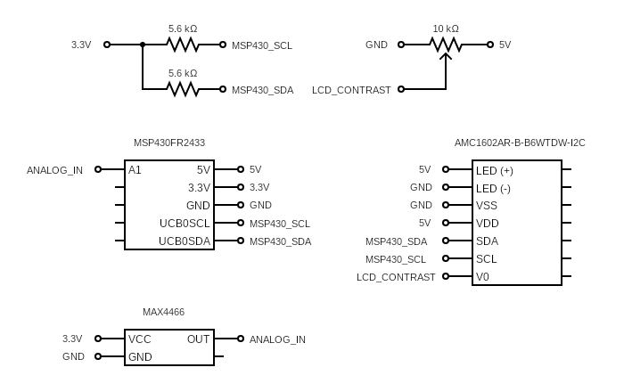

# Guitar Tuner
This is a design for a guitar (or any instrument) tuner created with a TI 
MSP430, a MAX4466 microphone, and a 16x2 LCD display with an I2c controller.  

## Frequency Detection
The MSP reads several values over one second from the MAX via the on-board ADC 
to generate a waveform, and calculates the approximate frequency of the 
waveform. It is not necessary to store the entire waveform, however, as only 
the frequency is needed. This is achieved by keeping the lowest value, called 
the trough, of each period. If the wave is on the way down, the trough keeps 
getting updated. If it is on the way up, if the minimum peak to peak is 
achieved, the frequency is incremented. This minimum is necessary to reduce 
inaccuracies from noise. The second is calculated via the an on-board timer 
module. The number of clock cycles used for one second was found through trial 
and error, and is approximate.  

## Display
Once the frequency of a one second sound wave is found, some information is 
displayed on the LCD. First, the closest musical notes both with a frequency 
above and below are displayed with their frequencies, as well as the detected 
frequency. These are found by performing a binary search in a lookup table, 
implemented as an array. The intent is to guide the user towards a desired 
note until the frequencies match. This is done via I2C. The on-board I2C 
controller is used, as well as the AC780S controller built into the LCD.  

## Example Output

Example of the MAX picking up a frequency of 654.  

## Circuit Diagram

## Finite State Machine

This is the fsm implemented by the code.

## Limitations
While this guitar tuner is an interesting idea in concept, it has some 
practical limitations. As is, it needs a constant sound signal for an entire 
second, and the source of the sound must be very close to the microphone, or 
very loud. This is currently the biggest issue with it, and makes it not too 
practical with a real guitar. Additionally, since everything is done in 
integers, the frequencies are not the most precise without the fraction 
portion. The time for a second is also an approximation, meaning the detected 
frequencies are also approximations. This could potentially be solved with the 
use of a crystal osciallator, as opposed to the MSP timer module, to achieve 
more accurate seconds. The current tuner is set to not detect frequencies 
lower than 33 Hz because it can be innacurate with lower frequencies. Despite 
these limitations, this was still a fun project to work on and, being my first 
embedded project, taught me a ton.
